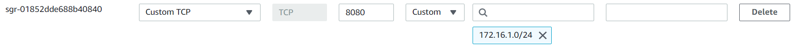
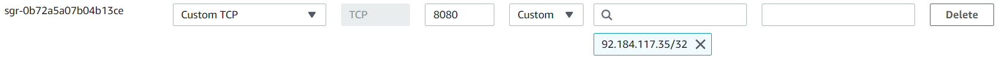
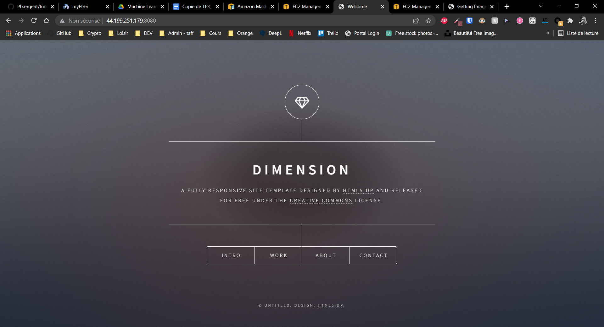

# DevOps - Ansible

**Machines**:
- *ToolsCICD*: 172.16.1.41
- *RemoteServer*: 172.16.1.201

## Ansible

### Introduction

Ping
```
ubuntu@ip-172-16-1-41:~$
ansible all -m ping -i ubuntu@172.16.1.201, --private-key ~/.ssh/key.pem
ubuntu@172.16.1.201 | SUCCESS => {
    "ansible_facts": {
        "discovered_interpreter_python": "/usr/bin/python3"
    },
    "changed": false,
    "ping": "pong"
}
```

---

*playbook.yml*
```
---
- hosts: all
  tasks:
        - name: test connection
          ping:
```

*hosts*
```
[remote_server]
172.16.1.201 ansible_ssh_private_key_file=~/.ssh/key.pem
```

Launch playbook
```
ubuntu@ip-172-16-1-41:~/TP_CICD/web_ami$ 
ansible-playbook -i hosts playbook.yml

PLAY [all] *************************************************************************************************************

TASK [Gathering Facts] *************************************************************************************************
ok: [172.16.1.201]

TASK [test connection] *************************************************************************************************
ok: [172.16.1.201]

PLAY RECAP *************************************************************************************************************
172.16.1.201               : ok=2    changed=0    unreachable=0    failed=0    skipped=0    rescued=0    ignored=0

```

### Website

*hosts*
```
[remote_server]
172.16.1.201 ansible_ssh_private_key_file=~/.ssh/key.pem
```

We use a template file for the apache virtual host configuration.

*virtualhost.conf*
```
<VirtualHost *:{{ http_port }}>
    DocumentRoot /var/www/{{ domain }}
    ErrorLog ${APACHE_LOG_DIR}/error.log
    CustomLog ${APACHE_LOG_DIR}/access.log combined
</VirtualHost>
```

*playbook-website.yml*
```
---
- hosts: remote_server
  become: yes
  vars:
    http_port: 8080
    domain: html

  tasks:
    - name: install packages
      apt:
        name: ['apache2', 'git']
        update_cache: yes
        state: latest

    - name: enabled mod_rewrite
      apache2_module: name=rewrite state=present
      notify:
        - restart apache2

    - name: apache2 listen on port {{ http_port }}
      lineinfile: dest=/etc/apache2/ports.conf regexp="^Listen 80" line="Listen {{ http_port }}" state=present
      notify:
        - restart apache2

    - name: apache2 virtual host
      template: src=virtualhost.conf dest=/etc/apache2/sites-available/000-default.conf

    - name: Remove default /var/www/html/
      file:
        path: /var/www/html
        state: absent

    - name: clone basic html template
      git: repo=https://github.com/cloudacademy/static-website-example.git dest=/var/www/html update=no
      notify:
        - restart apache2

  handlers:
    - name: restart apache2
      service: name=apache2 state=restarted
```

---

Launch playbook-website.yml
```
ubuntu@ip-172-16-1-41:~/TP_CICD/web_ami$ ansible-playbook -i hosts playbook-website.yml

PLAY [remote_server] ***************************************************************************************************************************************

TASK [Gathering Facts] *************************************************************************************************************************************
ok: [172.16.1.201]

TASK [install packages] ************************************************************************************************************************************
ok: [172.16.1.201]

TASK [enabled mod_rewrite] *********************************************************************************************************************************
ok: [172.16.1.201]

TASK [apache2 listen on port 8080] *************************************************************************************************************************
ok: [172.16.1.201]

TASK [apache2 virtual host] ********************************************************************************************************************************
ok: [172.16.1.201]

TASK [Remove default /var/www/html/] ***********************************************************************************************************************
changed: [172.16.1.201]

TASK [clone basic html template] ***************************************************************************************************************************
changed: [172.16.1.201]

RUNNING HANDLER [restart apache2] **************************************************************************************************************************
changed: [172.16.1.201]

PLAY RECAP *************************************************************************************************************************************************
172.16.1.201               : ok=8    changed=3    unreachable=0    failed=0    skipped=0    rescued=0    ignored=0
```

---

Check from the remote server:
```
ubuntu@ip-172-16-1-201:~$
systemctl status apache2
● apache2.service - The Apache HTTP Server
   Loaded: loaded (/lib/systemd/system/apache2.service; enabled; vendor preset: enabled)
  Drop-In: /lib/systemd/system/apache2.service.d
           └─apache2-systemd.conf
   Active: active (running) since Thu 2022-03-17 16:16:17 UTC; 1min 41s ago
  Process: 31124 ExecStop=/usr/sbin/apachectl stop (code=exited, status=0/SUCCESS)
  Process: 31129 ExecStart=/usr/sbin/apachectl start (code=exited, status=0/SUCCESS)
 Main PID: 31143 (apache2)
    Tasks: 55 (limit: 1140)
   CGroup: /system.slice/apache2.service
           ├─31143 /usr/sbin/apache2 -k start
           ├─31145 /usr/sbin/apache2 -k start
           └─31146 /usr/sbin/apache2 -k start
```

Check from the tool_cicd server (after allowing the port 8080 from the subnet 172.16.1.0/24):



```
lynx http://172.16.1.201:8080
...
curl http://172.16.1.201:8080
```

Check from a public machine (after allowing port 8080 from my ip):



